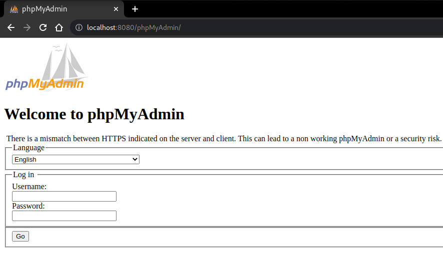

# h2cSmuggler-proxy


## Description

[h2cSmuggler](https://github.com/BishopFox/h2csmuggler) smuggles HTTP traffic past insecure edge-server `proxy_pass` configurations by establishing HTTP/2 cleartext (h2c) communications with h2c-compatible back-end servers, allowing a bypass of proxy rules and access controls.

This script just implement a proxy over h2cSmuggler so you can navigate in your browser making requests to the back-end server.

```
$ ./h2csmuggler-proxy.py -x https://www.example.com https://localhost
Now serving at 8080
[INFO] h2c stream established successfully.
[INFO] Requesting - /phpMyAdmin/
127.0.0.1 - - [14/May/2022 19:56:58] "GET /phpMyAdmin/ HTTP/1.1" 200 -
```



## ToDo

* Support POST requests.

## Author

Twitter: [@ricardo_iramar](https://twitter.com/ricardo_iramar)